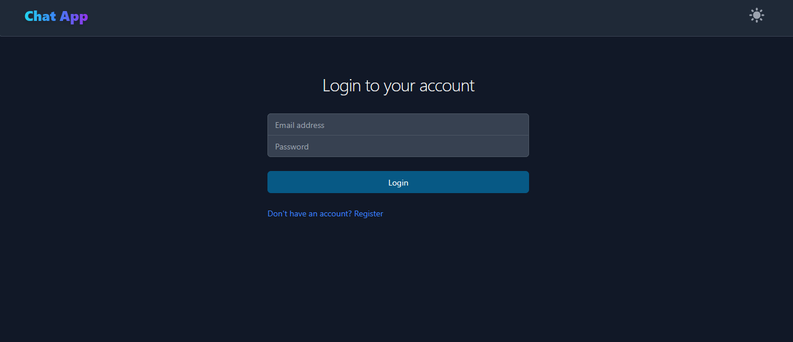
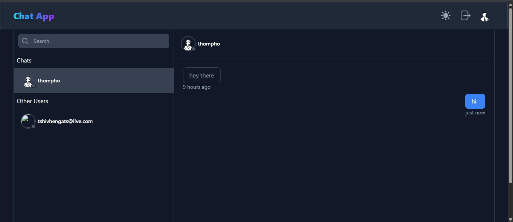

# 💬 Real-Time Chat Application

A modern, full-stack real-time chat application built with the MERN stack (MongoDB, Express, React, Node.js) and powered by Firebase Authentication, Socket.io for real-time messaging, and Tailwind CSS for styling. Users can register, log in, send and receive messages in real-time, manage chat rooms, and enjoy a sleek responsive interface.

---

## 🌐 Live Demo

**Frontend:** [https://chat-app-02-gb3s.vercel.app](https://chat-app-02-gb3s.vercel.app)
**Backend:** Deployed via Render (URL hidden for security)

---

## 👀 Features

* ✉️ Real-time 1:1 chat
* 📡 Socket.io-based live messaging
* 🚀 Firebase Authentication (Register/Login/Logout)
* ⚡ Typing indicator
* 💬 Message read receipts (WIP)
* 🔐 Protected routes using React Context
* 🌎 Avatar generator for users
* 🌟 Light/Dark theme toggling
* 🔄 Auto-scroll to latest message
* ✅ Deployed frontend (Vercel) and backend (Render)

---

## 📁 Project Structure

```
.
├── frontend                 # Vite + React
│   ├── src
│   │   ├── components       # UI Components (Accounts, Chat, Layouts)
│   │   ├── config           # Firebase config
│   │   ├── contexts         # Auth Context
│   │   ├── services         # Chat API services
│   │   └── utils            # Utilities (Avatar Generator, Route Guard)
├── server                   # Node + Express API
│   ├── config               # MongoDB & Firebase Admin SDK
│   ├── controllers          # Route Logic
│   ├── models               # Mongoose Models
│   ├── routes               # API Routes
│   └── middlewares          # JWT Auth Middleware
```

---

## 🚀 Getting Started

### 1. Clone Repository

```bash
git clone https://github.com/trollpy/chat-app-02.git
cd chat-app-02
```

### 2. Setup Frontend

```bash
cd frontend
npm install
npm run dev
```

### 3. Setup Backend

```bash
cd ../server
npm install
```

#### Create `.env` in `/server`:

```env
PORT=5000
MONGO_URI=your_mongodb_connection_string
FIREBASE_ADMIN_KEY=your_stringified_serviceAccountKey_json
```

#### Convert `serviceAccountKey.json` to string:

```bash
node -e "console.log(JSON.stringify(require('./serviceAccountKey.json')));"
```

Paste output into `.env` as `FIREBASE_ADMIN_KEY`

### 4. Run Backend

```bash
npm run dev
```

---

## 🚩 Deployment

### Frontend

* **Hosted on Vercel**
* Output directory: `dist`

### Backend

* **Hosted on Render**
* Configure environment variables:

  * `PORT`
  * `MONGO_URI`
  * `FIREBASE_ADMIN_KEY`

---

## 🎨 Screenshots

### 🧑‍💻 Login Screen


### 💬 Chat Interface



---

## 🚜 Future Improvements

* 🔥 Message delete/edit
* 🧳 Socket.io rooms for group chat
* 📃 Image/file upload
* 🔍 User search enhancements
* ⏳ Chat history persistence

---

## ✉️ Author

**Thompho Sheriff** — [@trollpy](https://github.com/trollpy)

---

## ⚒️ Tech Stack

* **Frontend:** React, Vite, Tailwind CSS, Firebase Auth
* **Backend:** Node.js, Express, MongoDB, Socket.io, Firebase Admin SDK

---


